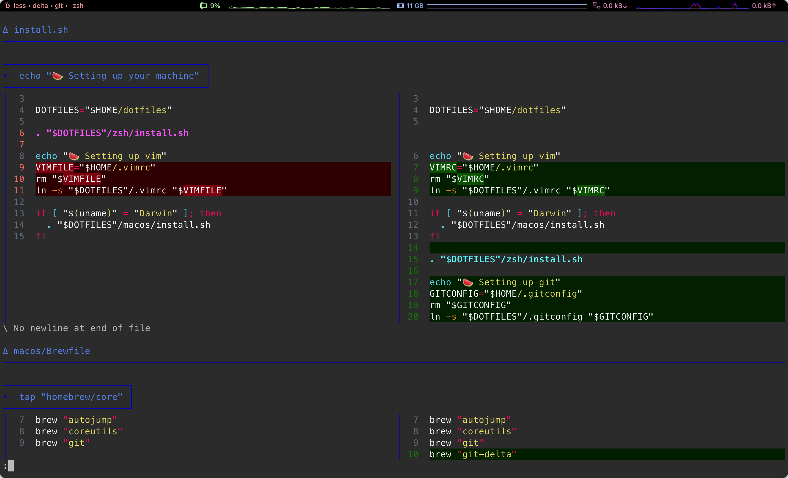

# Jiachen's Dotfiles

## Pre Requirements

### Basic Requirements

- Download this repo via git or other ways.
- Some mac configurations
(e.g. iCloud / Mac App Store account / keyboard shortcuts)
still need manual operations.

### Folder Structure

This repo assumes the user puts the repo under the home fold.
This assumption makes scripts to locate files easier.

### Proxy

Setting up proxy before running `./install.sh` could improve the download
speed.

## References

- [dotfiles.github.io](https://dotfiles.github.io/)
- [driesvints/dotfiles](https://github.com/driesvints/dotfiles)
- [mathiasbynens/dotfiles/.macos](https://github.com/mathiasbynens/dotfiles/blob/main/.macos)
