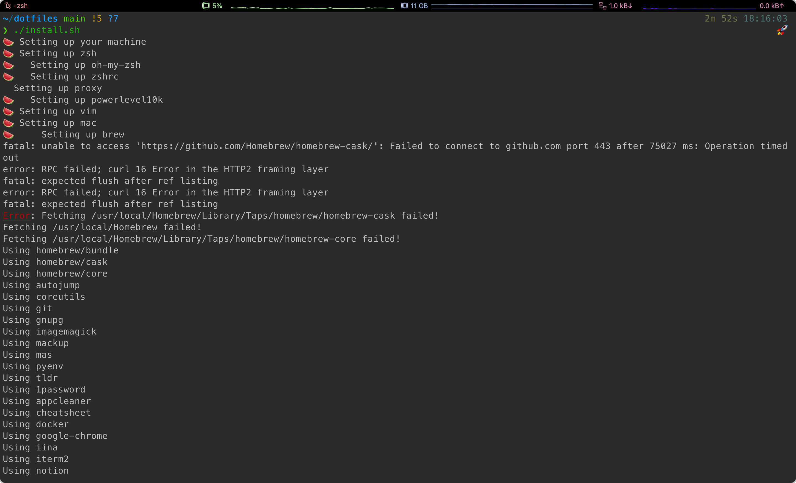
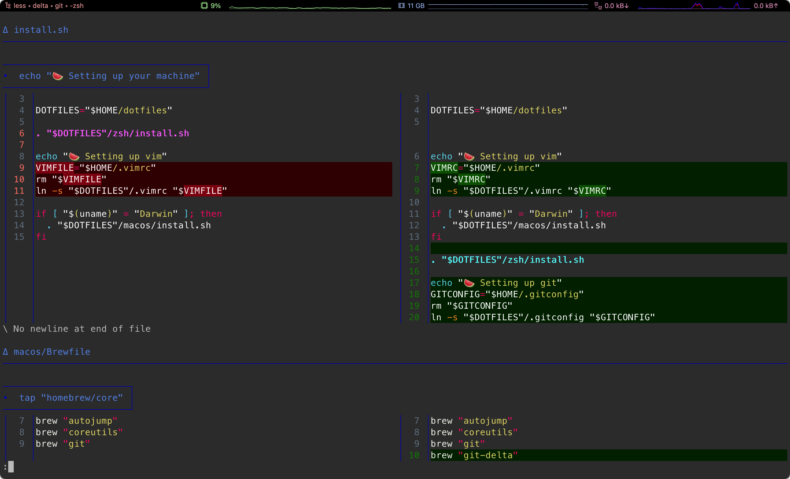

# Jiachen's Dotfiles

## Pre Requirements

### Basic Requirements

- Download this repo via git or other ways.
- Some mac configurations
(e.g. iCloud / Mac App Store account / keyboard shortcuts)
still need manual operations.

### Folder Structure

This repo assumes the user puts the repo under the home fold.
This assumption makes scripts to locate files easier.

### Proxy

Setting up proxy before running `./install.sh` could improve the download
speed.

## Workspace

Run `sh ~/dotfiles/workspace/install.sh` to set up or refresh the workspace
without running the full machine installer. The main `install.sh` also runs it.

- Creates `~/Workspace/local` and replaces `~/Workspace/AGENTS.md` with a link to
  `workspace/AGENTS.workspace.md`. The dotfiles version is authoritative.
- Reads `workspace/github-repos.txt`: one public GitHub `owner/repo` per line,
  with optional `#` comments. Only add repositories
  you want on every machine; private remotes and machine-specific inventories
  do not belong here.
- Clones missing repositories into `~/Workspace/github.com/<owner>/<repo>`.
  Existing matching checkouts fetch `origin`; clean branches tracking `origin`
  also pull with `--ff-only` when possible. Modified, detached, ahead, and
  diverged checkouts keep their local state. Removing a list entry does not
  delete its checkout. No repository setup scripts or submodules are executed.
- Uses the `codex` CLI's native config API to set the App's projectless task
  folder to `~/Workspace/local/chatgpt`. It reads the current setting (default:
  `~/Documents/Codex`), changes the setting first, then moves existing files and
  leaves a relative old-path compatibility link for historical chats. A link
  that arrives through iCloud before this machine has run the installer is left
  alone. It does not inspect running tasks or require the App to quit. Existing
  nonempty source and destination directories are never merged. Reopening the
  App may be needed to refresh cached settings.

GitHub syncing needs `git`, `curl`, and `jq`; App configuration needs `codex`
and `jq` on `PATH`. Missing tools, unavailable public repositories, and network
failures are reported as skipped steps. Invalid entries, path conflicts, config
errors, and migration failures return a nonzero exit status. All steps can be
rerun. Other App settings and chat databases are left to the native config API;
cloud links and private repositories are not managed by this installer.

## References

- [dotfiles.github.io](https://dotfiles.github.io/)
- [driesvints/dotfiles](https://github.com/driesvints/dotfiles)
- [mathiasbynens/dotfiles/.macos](https://github.com/mathiasbynens/dotfiles/blob/main/.macos)
